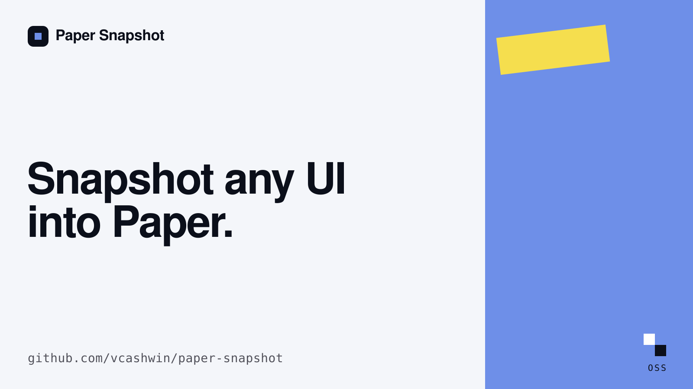

# paper-snapshot

Tree-shakeable monorepo for capturing live DOM elements as inline-styled HTML — the same engine behind [Paper Snapshot](https://paper.design/snapshot-extension). Paste the result into Paper desktop or any HTML-aware editor.



## Packages

| Package | Import | Purpose |
|---------|--------|---------|
| [`@paper-snapshot/core`](./packages/core) | `@paper-snapshot/core/picker` | Element picker, serializer, clipboard |
| [`@paper-snapshot/react`](./packages/react) | `@paper-snapshot/react/use-snapshot-capture` | React hook + toast UI |
| [`@paper-snapshot/electron`](./packages/electron) | `@paper-snapshot/electron/clipboard`, `@paper-snapshot/electron/inject` | Electron clipboard + webview capture |

Each subpath is a **separate ESM entry** with `"sideEffects": false` — bundlers only include what you import.

## Install

```bash
pnpm add @paper-snapshot/core
pnpm add @paper-snapshot/react
pnpm add @paper-snapshot/electron   # optional
```

## Quick start (vanilla)

```ts
import { captureAndCopy } from "@paper-snapshot/core/capture";

const result = await captureAndCopy();
if (result.status === "success") {
  console.log("Copied — paste into Paper");
}
```

## React

```tsx
import { useSnapshotCapture } from "@paper-snapshot/react/use-snapshot-capture";
import { SnapshotHud } from "@paper-snapshot/react/snapshot-ui";

function Toolbar() {
  const snapshot = useSnapshotCapture({ copyToClipboard: true });

  return (
    <>
      <button onClick={snapshot.start} disabled={snapshot.isActive}>
        Capture
      </button>
      <SnapshotHud snapshot={snapshot} />
    </>
  );
}
```

## Electron

`@paper-snapshot/electron` is optional. Use it when your app runs in Electron and you want **native clipboard writes** (`clipboard.writeHTML`) instead of the browser `navigator.clipboard` / `execCommand` path from `@paper-snapshot/core/clipboard`.

Install:

```bash
pnpm add @paper-snapshot/core @paper-snapshot/electron
# with React UI:
pnpm add @paper-snapshot/react
```

### Renderer — capture UI in your Electron window

When the picker runs in the **same renderer** as your React app (most common):

```tsx
import { useSnapshotCapture } from "@paper-snapshot/react/use-snapshot-capture";
import { SnapshotHud } from "@paper-snapshot/react/snapshot-ui";
import { createElectronClipboardWriter } from "@paper-snapshot/electron/clipboard";

function App() {
  const snapshot = useSnapshotCapture({
    copyToClipboard: true,
    writeClipboard: createElectronClipboardWriter(),
  });

  return (
    <>
      <button onClick={snapshot.start} disabled={snapshot.isActive}>
        Capture element
      </button>
      <SnapshotHud snapshot={snapshot} />
    </>
  );
}
```

Or without React, in the renderer:

```ts
import { captureAndCopy } from "@paper-snapshot/core/capture";
import { writeHtmlToClipboard } from "@paper-snapshot/electron/clipboard";
import { wrapForPaper } from "@paper-snapshot/core/wrap";

const result = await captureAndCopy({ copyToClipboard: false });
if (result.status === "success") {
  writeHtmlToClipboard(wrapForPaper(result.html));
}
```

### Main process — clipboard only

If you already have HTML in the main process:

```ts
import {
  writeHtmlToClipboard,
  readHtmlFromClipboard,
} from "@paper-snapshot/electron/clipboard";

writeHtmlToClipboard("<x-paper-html>...</x-paper-html>");
const pasted = readHtmlFromClipboard();
```

### `<webview>` / guest pages — capture arbitrary web content

When the user picks elements **inside a guest page** (BrowserView, `<webview>`, etc.), run capture in that page's context via a **preload script**, then copy from the main process.

**1. Preload** (`preload.ts`):

```ts
import { contextBridge } from "electron";
import { captureAndCopy } from "@paper-snapshot/core/capture";
import { wrapForPaper } from "@paper-snapshot/core/wrap";

contextBridge.exposeInMainWorld("__snapshot", {
  captureAndCopy: async (options = {}) => {
    const result = await captureAndCopy({ ...options, copyToClipboard: false });
    if (result.status !== "success") return result;
    return { ...result, wrappedHtml: wrapForPaper(result.html) };
  },
});
```

**2. Main process** — trigger capture on the guest `WebContents`:

```ts
import { ipcMain } from "electron";
import { captureFromWebContents } from "@paper-snapshot/electron/inject";

ipcMain.handle("snapshot:capture", async (_event, webContents) => {
  return captureFromWebContents({
    webContents,
    copyToClipboard: true,
  });
});
```

`captureFromWebContents` calls `window.__snapshot.captureAndCopy()` inside the guest page, then writes the wrapped HTML to the system clipboard via Electron.

### Global shortcut (optional)

Register in the main process, start capture in the focused renderer:

```ts
import { globalShortcut, BrowserWindow } from "electron";

globalShortcut.register("CommandOrControl+Shift+P", () => {
  const win = BrowserWindow.getFocusedWindow();
  win?.webContents.send("snapshot:start");
});
```

In the renderer, listen for `snapshot:start` and call `snapshot.start()` from `useSnapshotCapture`.


```bash
pnpm install
pnpm build
pnpm typecheck
pnpm dev:demo
```

## Publish to npm

See **[PUBLISHING.md](./PUBLISHING.md)**.

## License

MIT
